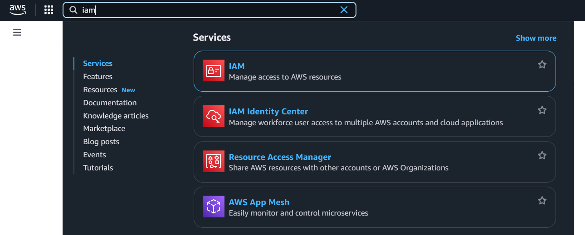
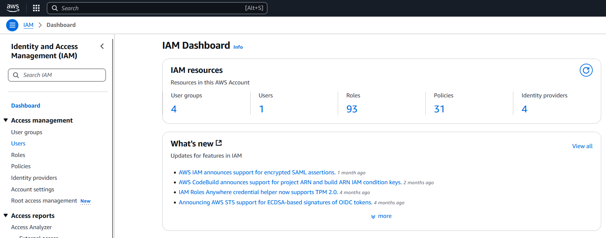
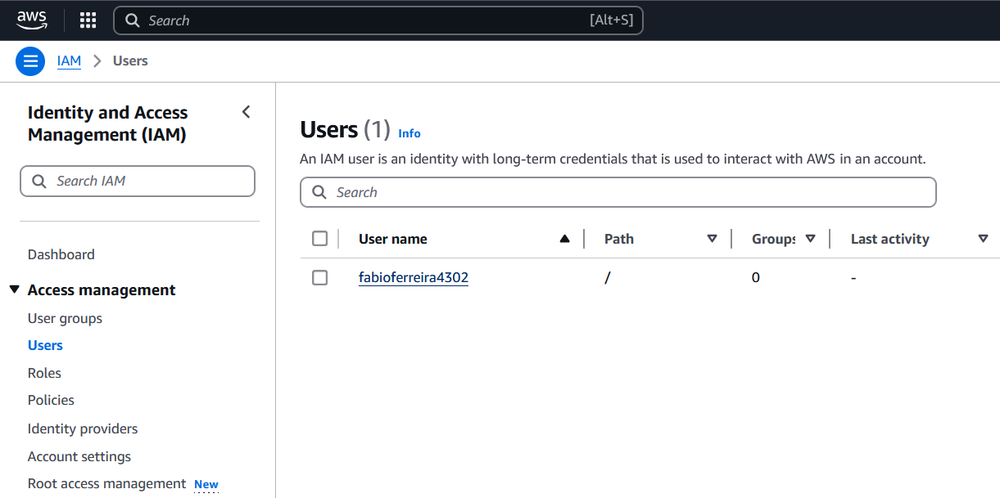
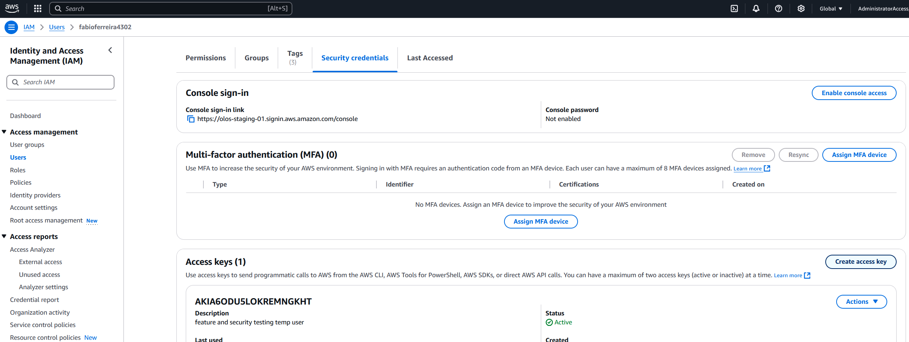
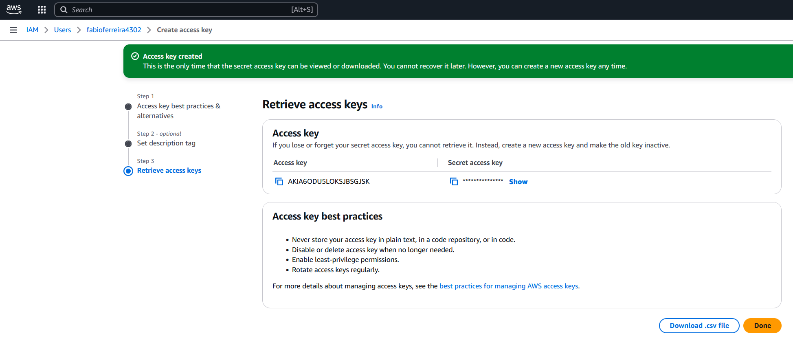

# Fiap - 5ASOR - Arquitetura Microcontainers - Prof. Leandro

Repositório do trabalho de conclusão de disciplina Fiap.

## Índice

1. [Descrição da Atividade](#1-descrição-da-atividade)
2. [Membros do Grupo](#2-membros-do-grupo)
3. [Pré-requisitos](#3-pré-requisitos)
4. [Passo a Passo](#4-passo-a-passo)

## 1. Descrição da Atividade

Você foi contratado para atuar no time DevOps, com a responsabilidade de provisionar um site Wordpress, para que o time de Marketing Digital possa configurar o site principal da companhia. O Kubernetes é a solução oficial de orquestração dos containers da empresa. O MySQL é tecnologia de banco de dados principal, com um time de DBA especializados para sustentação. Foi solicitado o provisionamento do Wordpress, e um banco de dados MySQL de uso exclusivo do Wordpress, para persistência de todas as configurações realizadas pelo time de Marketing Digital. Tanto o Wordpress quanto o MySQL deverão estar em containers geridos pelo Kubernetes.

Para isso, você deverá criar todas as configurações Kubernetes necessárias para provisionamento do Wordpress e MySQL, utilizando microk8s ou k3s, permitindo instanciar todos pods, services, ingress e configurações adicionais necessárias, garantindo que mesmo ao destruir um pod Wordpress e/ou MySQL, os dados de configuração do ambiente Wordpress não sejam perdidos. 

Enviar um arquivo .zip, contendo todos os arquivos de configuração Kubernetes, com as instruções para aplicação dessas configs, possibilitando o deployment da solução e utilização do Wordpress.

As instruções deverão estar descridas num arquivo PDF, Markdown ou txt, com imagens ilustrativas e texto descritivo, indicando quais sequências de comandos devem ser aplicados passo a passo, para instalação do Kubernetes a partir de uma VM Ubuntu (AWS EC2 ou Killercoda) e provisionamento do site Wordpress. Serão seguidas as instruções conforme descritas e o trabalho será avaliado nos seguinte pontos:
    - Atendimento das necessidades da área de Marketing Digital (irei simular um profissional dessa área tentando configurar o Wordpress para a empresa);
    - O Wordpress deverá funcionar após seguir o passo a passo descrito;
    - Será simulado a perda dos pods do Wordpress e MySQL, para validar a resiliência da solução construída;
    - Clareza nas instruções;
    - Completude das configurações disponibilizadas no arquivo .zip, com orientação de suas aplicações no ambiente;
    - Caso o grupo desejar, pode ser disponibilizado um script de IaC (Ansible, Terraform, etc.) ou módulo Kustomize (https://kubectl.docs.kubernetes.io/references/kustomize/kustomization/) para empacotamento das configurações K8S.

## 2. Membros do Grupo

- Anderson Luis Lins Rocha
- Augusto Oening Costa
- Carlos Correa
- Fabio Ferreira da Silva
- Giliane Maciel do Vale
- Michael Andre Santos Brito

## 3. Pré-requisitos

Este guia pressupõe que o professor ou responsável pelo provisionamento e testes já possua:

- Uma conta AWS configurada;
- Um usuário com direitos administrativos.
- Consideramos o uso de um usuário de IAM e **NÃO** iremos abordar configurações com o AWS Identity Center.
- [docker desktop](https://docs.docker.com/get-started/get-docker/) instalado e atualizado no Windows WSLv2 ou Mac.
- [git-scm](https://git-scm.com/downloads)

ATENÇÃO! Não abordamos neste material:

- Como criar ou configurar uma conta AWS.
- Como adicionar usuários e políticas de acesso na AWS.
- Como instalar e configurar o Windows WSLv2.
- Instalar o docker desktop.
- Instalar o git-scm.

:bangbang: Os recursos provisionados por este laboratório geram custos!

- Região: us-east-2
- EC2 instance t3.medium: USD 0.0416 por hora
- Amazon EBS(gp3): USD 0,08GB-mês
- Internet data transfer(outbound): 100GB free tier por mês

## 4. Passo a Passo

Antes de começar, clone este repositório em sua máquina e mude para o diretório recém clonado com os comandos abaixo:

```bash
# Clonar o REPO
git clone git@github.com:fabiocore/5asor-arquitetura-microcontainers.git

# Criar um diretorio de trabalho e outputs "live"
# Este diretorio está incluso no .gitignore
mkdir live

# Mudar para o diretório recém clonado
cd 5asor-arquitetura-microcontainers
```

A seguir, este é nosso plano de implementação para infraestrutura, Kubernetes e aplicações:

- [4.1. Configuração das credenciais do usuário](#41-configuração-das-credenciais-do-usuário)
- (WIP)

### 4.1. Configuração das credenciais do usuário

Passo a passo para configuração das credenciais do usuário (AccessKey e SecretKey):

Faça o login em sua conta AWS, na mesma janela, pressione ALT+S e busque por IAM:



Do lado esquerdo, no menu do Identiy and Access Management(IAM), click em Users:



Localize seu usuário e de um click nele:



Na parte principal, vá em Security Credentials e depois de um click em Create access key:



Para finalizar o processo através do wizard:

- Selecione Command Line Interface (CLI)
- Click em "I understand the above recommendation and want to proceed to create an access key."
- Next
- Insira uma descrição (opcional) e click em `Create access key`

Faça o download do arquivo .csv com as credenciais de acesso dando um click em `Download .csv file`:


> OBSERVAÇÃO: As Access Keys acima foram criadas temporariamente e não existem mais.


